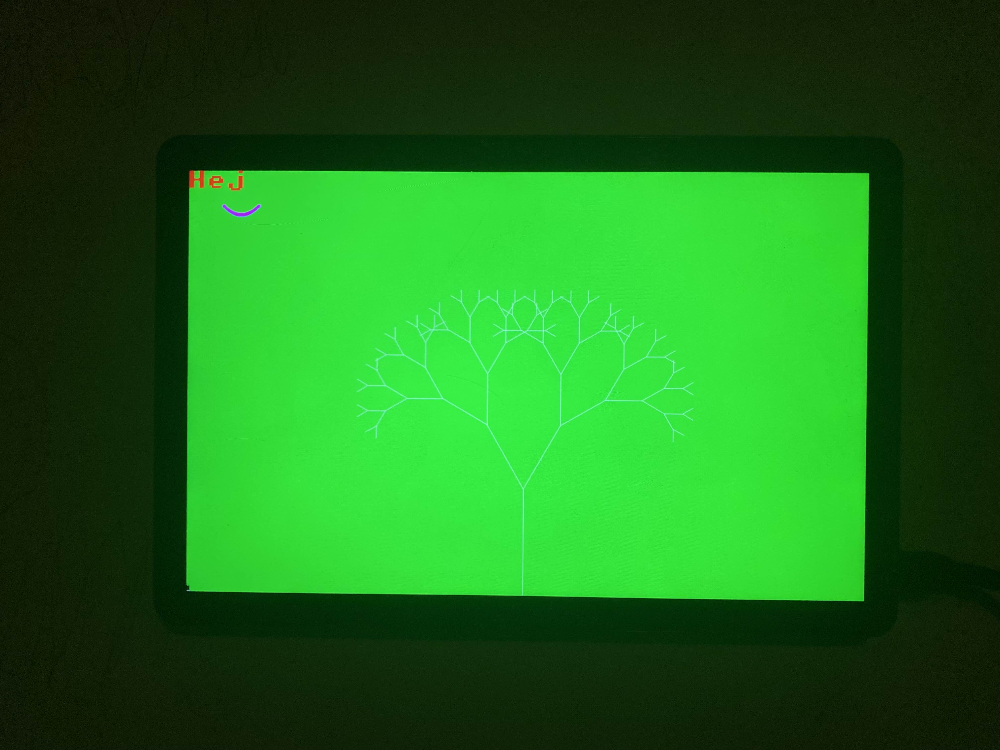

# Simple x11 and linux framebuffer graphics engine

create a window

or write directly onto linux framebuffer

currently linux only, windows support is theory (not a priority)

you need to build lib on your platform first (look buildlinux.sh)

unicode support would be nice but complicated (not a priority)

this is mainly for me by me but since i feel like sharing here you go

have fun with it